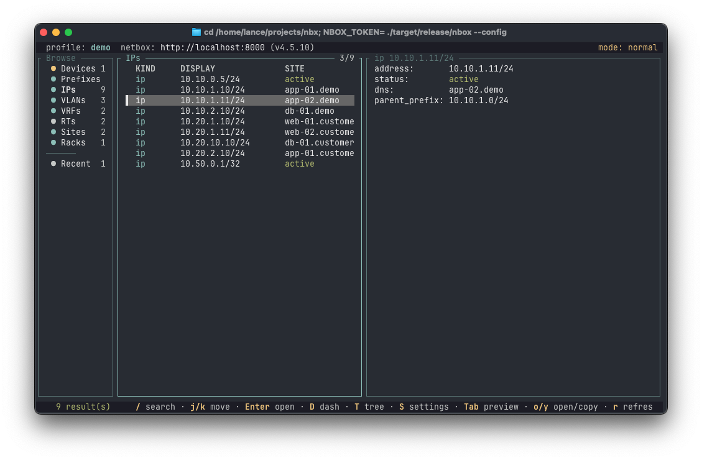

# nbox

Terminal UI and CLI for NetBox — fast search, IPAM lookups, and device context.

<p align="center">
  
</p>

[](https://crates.io/crates/nbox)
[](https://github.com/lance0/nbox/actions/workflows/ci.yml)
[](LICENSE-MIT)
[](https://ko-fi.com/lance0)

Ask the questions you actually ask at the terminal — *what is this IP, where is
this device, what owns this prefix?* — from the shell, a k9s-style TUI, or an MCP
server for AI agents.

**Status: pre-1.0.** Reads are the default; a narrow safe-write foundation
(ADR-0001) has landed behind `--allow-writes` + confirmation — three commands
today (`nbox interface <device> <interface> set description "…"`,
`nbox device <name> set status <value>`, and `nbox ip reserve <prefix>` to
allocate the next available IP). Broader writes are on the [ROADMAP](ROADMAP.md).

## Quick Start

First run? Just launch the TUI — with no config it opens a first-run wizard that
captures a profile, test-connects it, and drops you into the app. Paste a token
and nbox saves it in your user-only `config.toml` (`0600` on Unix, redacted in
`config show`); or point a profile at an env var instead with `token_env`.

```bash
nbox                              # first run: guided onboarding, then the TUI
```

Prefer the shell? Configure a profile by hand:

```bash
nbox profile add work https://netbox.example.com --token-env NETBOX_TOKEN
nbox profile use work
export NETBOX_TOKEN=...           # env vars override the saved config token

# Look things up from the shell
nbox search edge01
nbox device edge01
nbox ip 10.44.208.55
nbox prefix 10.44.208.0/24
```

See [Installation](#installation) below for setup instructions.

## Features

- **Fast shell lookups** — `device`, `ip`, `prefix`, `vlan`, `site`, `rack`, `circuit`, `virtual-circuit`, `provider`, `aggregate`, `asn`, `ip-range`, `tenant`, `contact`, `vm`, `cluster`, `vrf`, `route-target`, `mac`, and `interface`, each as a one-liner.
- **Normalized search** — one `search` query runs in parallel across devices, sites, racks, IPs, prefixes, VLANs, circuits, virtual circuits, providers, aggregates, ASNs, IP ranges, tenants, contacts, VMs, clusters, VRFs, and route targets, returning ranked, deduped hits. Scope it with `--site` (exact) or `--region`/`--site-group`/`--location` (hierarchical where NetBox exposes tree filters), one at a time; or narrow by `--status`/`--tenant`/`--role`/`--tag`/`--vrf`.
- **IPAM-aware** — IP → most-specific parent prefix → VLAN → scope resolution, prefix utilization and children, a navigable prefix tree, and `next-ip` / `next-prefix` to preview free addresses and blocks (read-only). To actually claim one, `nbox ip reserve <prefix>` allocates the next available IP (a safe write — ADR-0001).
- **A k9s-style TUI** — a three-pane home (navigation rail → results → live preview), an overview dashboard, a hierarchical prefix tree, cross-object navigation between related objects (every detail's related-object tabs are navigable — open an interface from a device and see its cable path drawn as an A↔Z diagram), fuzzy filters, server-side name filtering on the browse list, recents, and an in-app profile + settings editor. Twelve themes; `NO_COLOR` honored.
- **Agent-ready** — `nbox serve` is a read-only MCP server: the same lookups exposed as eleven tools (plus every object as an `nbox://{kind}/{ref}` resource), returning the exact JSON view models the CLI does, so AI agents (Claude Code, Claude Desktop, …) query NetBox safely. Stdio for a local subprocess, or a loopback HTTP transport with OIDC resource-server auth for a network-reachable, read-only deployment. See [docs/MCP.md](docs/MCP.md); [SKILL.md](SKILL.md) is an installable Agent Skill that drives the CLI on matching requests.
- **Scriptable** — `-o plain|json|csv`, `--fields`, `--raw`, versioned `--envelope`, and stable exit codes; stdout stays clean for piping, logs go to stderr. See [docs/SCRIPTING.md](docs/SCRIPTING.md).
- **Fast on repeat** — a small in-memory read cache (per profile, ~30s) keeps TUI back-navigation and chatty agents from re-hitting NetBox; the detail footer shows "cached Ns ago" and `nbox_cache_clear` busts it.
- **Multi-instance** — profiles for several NetBox instances (switch live in the TUI), journals folded into detail lookups, open-in-browser and copy, and tag listing.

See [docs/FEATURES.md](docs/FEATURES.md) for the full command reference,
[docs/COMPARISON.md](docs/COMPARISON.md) for how nbox compares to the NetBox web
UI and raw API calls, and [docs/ARCHITECTURE.md](docs/ARCHITECTURE.md) for the
internals.

### nbox vs the NetBox web UI vs raw API

nbox doesn't replace NetBox — it's a fast read path into it. When to reach for which:

| Task | nbox | NetBox web UI | `curl` / `pynetbox` |
|------|------|---------------|---------------------|
| "What is this IP?" (address → prefix → VLAN → scope) | one command / one keystroke | several clicks across pages | several requests + manual joins |
| Search across object types at once | one ranked, deduped query | per-type search pages | one request per endpoint |
| Use it over SSH on a jump host | yes — one static binary, no runtime | no (needs a browser) | only if Python/curl are present |
| Machine output (JSON/CSV, stable exit codes) | built in | no | you build it |
| Feed an AI agent | built in (`nbox serve`, MCP) | no | you build it |
| Reserve / allocate / edit (writes) | narrow & safe behind `--allow-writes` + confirm (ADR-0001) | yes | yes |

Full matrix and a "when to use each" guide: [docs/COMPARISON.md](docs/COMPARISON.md).

## Real-World Use Cases

### What is this IP?

```bash
nbox ip 10.44.208.55
```

Resolves the address, its most-specific parent prefix (VRF-scoped), the prefix's
VLAN, and its scope (site, location, region, …). Add `--vrf <name>` when the same
address exists in several VRFs.

### Where is this device, and what's on it?

```bash
nbox device edge01
```

Device plus its interfaces, IP addresses, cables, VLANs, and services in one
lookup. In the TUI, the device screen splits these onto `i`/`p`/`c`/`v`/`s` tabs.

### Find the next free address or block

```bash
nbox next-ip 10.44.208.0/24 --count 4      # next available addresses
nbox next-prefix 10.0.0.0/8 --length 26    # first free /26
```

Read-only — nothing is reserved. Both take `--vrf` to scope the prefix.

### Pull data into a script

```bash
nbox device edge01 --json | jq '.primary_ip4'
nbox search edge01 -o csv --cols kind,display,url > devices.csv
nbox prefix 10.44.208.0/24 --json --envelope --raw   # versioned, single-line
```

### Drive it from an agent

```bash
claude mcp add nbox -e NBOX_TOKEN=nbt_xxx.yyy -- nbox serve
```

`nbox serve` is a read-only MCP server; an MCP host launches it as a subprocess
and gets the same JSON view models the CLI returns. See [docs/MCP.md](docs/MCP.md).

## Installation

### From crates.io (Recommended)

Requires [Rust 1.88+](https://www.rust-lang.org/tools/install):

```bash
# Install Rust (if not already installed)
curl --proto '=https' --tlsv1.2 -sSf https://sh.rustup.rs | sh
source ~/.cargo/env

# Install nbox
cargo install nbox
```

### Homebrew (macOS/Linux)

```bash
brew install lance0/tap/nbox
```

### Docker (GHCR)

Multi-arch image (amd64/arm64):

```bash
docker run --rm ghcr.io/lance0/nbox:latest --help
```

Mount a config or pass `-e NBOX_TOKEN=...` plus a profile (or `--config`) to run
real lookups against your NetBox.

### Pre-built Binaries

Download from [GitHub Releases](https://github.com/lance0/nbox/releases):

| Platform | Target |
|----------|--------|
| Linux x86_64 | `nbox-x86_64-unknown-linux-musl.tar.gz` |
| Linux ARM64 | `nbox-aarch64-unknown-linux-musl.tar.gz` |
| macOS Apple Silicon | `nbox-aarch64-apple-darwin.tar.gz` |
| macOS Intel | `nbox-x86_64-apple-darwin.tar.gz` |
| Windows x86_64 | `nbox-x86_64-pc-windows-msvc.zip` |

```bash
# Download, verify, and install (Linux x86_64 example)
curl -LO https://github.com/lance0/nbox/releases/latest/download/nbox-x86_64-unknown-linux-musl.tar.gz
curl -LO https://github.com/lance0/nbox/releases/latest/download/SHA256SUMS
sha256sum -c SHA256SUMS --ignore-missing   # macOS: shasum -a 256 -c
tar xzf nbox-*.tar.gz && sudo mv nbox /usr/local/bin/
```

### Quick Install Script

> **Note**: Piping a script from the internet to sh is convenient but bypasses
> your chance to read it first. Use one of the methods above, or
> [review the script](scripts/install.sh) before running. It downloads the latest
> release binary for your OS/arch and falls back to `cargo install` if there's no
> asset for your platform.

```bash
curl -fsSL https://raw.githubusercontent.com/lance0/nbox/master/scripts/install.sh | sh
```

### From Source

```bash
git clone https://github.com/lance0/nbox
cd nbox && cargo install --path .
```

### Build Features

`cargo install nbox` builds the **canonical single binary** — clipboard, the MCP
server (stdio + HTTP transport), and update checks are all on by default. There
are no feature-variant builds to choose between.

| Feature | Default | Description |
|---------|---------|-------------|
| `clipboard` | Yes | Copy values with `y` in the TUI (desktop clipboard via `arboard`; SSH/headless fallback via OSC 52) |
| `http` | Yes | `nbox serve --http` loopback MCP transport (+ OIDC) |
| `updates` | Yes | GitHub update notifications |

The API token lives in `config.toml` (`token = "..."`, user-only `0600` on Unix)
or an env var — there is no OS-keyring storage.

```bash
# Lean stdio-only build (drops all of the above):
cargo install nbox --no-default-features
```

### Shell Completions

```bash
# Bash
nbox completions bash > ~/.local/share/bash-completion/completions/nbox

# Zsh (add ~/.zfunc to fpath in .zshrc first)
nbox completions zsh > ~/.zfunc/_nbox

# Fish
nbox completions fish > ~/.config/fish/completions/nbox.fish

# PowerShell (add to $PROFILE)
nbox completions powershell >> $PROFILE

# Elvish
nbox completions elvish > ~/.elvish/lib/nbox.elv
```

Man pages are available too. `nbox man > nbox.1` writes the top-level page; pass
a directory — `nbox man man/` — to write the full set instead (`nbox.1` plus one
`nbox-<subcommand>.1` per subcommand, so `man nbox-device` works once installed).

## Usage

```bash
nbox                              # launch the TUI
nbox status                       # connection + backend capabilities + NetBox/Django/Python versions
                                  # + token-validity preflight (NetBox 4.5+)
nbox search <query> [--limit N] [--status/--site/--region/--site-group/--location/--tenant/--role/--tag <v>] [--owner <name>] [--owner-group <name>] [--vrf <id|rd|name>] [--cols a,b,c] [--partial]
                                  # one scope flag at a time; --site is exact, region/site-group/location include descendants where supported.
                                  # --vrf filters IP/prefix results.
                                  # --owner/--owner-group filter by user/group name (NetBox 4.5+).
                                  # Full scope/filter semantics: docs/FEATURES.md
nbox device <name-or-id> [--journal] [--journal-limit N]
  device <name> set status <value>                    # write: status validated live via OPTIONS; --dry-run | --allow-writes --confirm [--message]
nbox ip <address> [--vrf <name>] [--journal]    # --vrf disambiguates duplicates across VRFs
                                  # shows nat_inside/nat_outside (NetBox 4.6) when set
  ip reserve <cidr> [--vrf <name>] [--description "…"] [--dns-name "…"]
                                  # write: reserve the next available IP (POST available-ips); --dry-run | --allow-writes --confirm [--message]
nbox prefix <cidr> [--vrf <name>] [--journal]   # includes utilization + children when present
nbox next-ip <cidr> [--count N] [--vrf <name>]        # next available address(es)
nbox next-prefix <cidr> [--length L] [--vrf <name>]   # available free block(s)
nbox vlan <vid-or-name> [--site <s>] [--group <g>] [--journal]
nbox site <name-or-slug> [--journal]
nbox rack <name-or-id> [--journal]
nbox rack-group <slug-or-name-or-id>             # NetBox 4.6+
nbox circuit <cid-or-id> [--journal]              # incl. its A↔Z terminations + path
nbox virtual-circuit <cid-or-id>                   # incl. its multi-point terminations (4.2+)
nbox provider <slug-or-name-or-id>
nbox aggregate <cidr-or-id> [--journal]
nbox asn <number> [--journal]
nbox ip-range <start-or-id> [--journal]
nbox tenant <slug-or-name-or-id>
nbox contact <name-or-id>
nbox vm <name-or-id>
nbox vm-type <slug-or-name-or-id>                 # NetBox 4.6+
nbox cluster <name-or-id>
nbox interface <device> <interface>
  interface <device> <interface> set description "…"   # write: --dry-run | --allow-writes --confirm [--message]
nbox tags                         # list tags (slug, name, count)
nbox tagged <tag>                 # objects carrying a tag, across kinds
                                  # (NetBox 4.3+; tag = id|name|slug)
nbox journal <kind> <ref>         # recent journal entries for an object
                                  # kinds incl. interface as <device>/<name>
                                  # --journal folds recent entries into a detail lookup (cap 5)
                                  # --journal-limit N overrides the cap (implies --journal)
nbox history <kind> <ref>         # system audit log (create/update/delete, who + when)
                                  # /api/core/object-changes/ (NetBox 4.x); distinct from journal
nbox open <kind>/<ref>            # device, ip, prefix, vlan, site, rack, rack-group, circuit, virtual-circuit, provider,
                                  # aggregate, asn, ip-range, tenant, contact, vm, vm-type, cluster, vrf, route-target,
                                  # and interface/<device>/<name> (the name may contain slashes,
                                  # e.g. xe-0/0/1)
nbox raw GET <api-path>           # raw read-only API request (escape hatch)
nbox serve [--http <addr>]        # read-only MCP server for AI agents (stdio, or loopback/OIDC HTTP)
                                  # --print-config prints the paste-ready mcpServers JSON and exits
nbox config <init|path|show|token>    # token: status reports the resolved source (never echoed)
nbox profile <add|use|remove|list|show>
nbox completions <bash|zsh|fish|powershell|elvish>
nbox man [DIR]                    # man pages: `nbox man > nbox.1` (top-level),
                                  # or `nbox man man/` for the full per-subcommand set
```

### Global flags

These apply to every command:

| Flag | Effect |
|------|--------|
| `-o, --output <fmt>` | `plain` (default), `json`, or `csv` (tabular/list results only) |
| `--json` | Shortcut for `-o json` |
| `--fields a,b,c` | JSON: keep only these top-level fields |
| `--raw` | JSON: compact (single line) instead of pretty |
| `--envelope` | JSON: wrap as `{ schema_version, data }` |
| `-p, --profile <name>` | Use a specific profile for this invocation |
| `--config <path>` | Use an alternate config file |
| `--log-level <spec>` | `tracing` filter (`info`, `debug`, `nbox=debug`, …) |
| `--log-file <path>` | Write logs to this file (and stderr); stdout stays clean |
| `--no-tui` | Refuse to launch the interactive TUI (a bare `nbox` or `nbox tui` exits `2` instead) |

`-o csv` is for tabular/list results (e.g. `search`); a single object is rejected
(use `--json` or plain). Custom fields appear as `cf.<name>` rows in plain output
and a `custom_fields` object in JSON.

Logs go to **stderr** by default (so stdout stays clean for piping and `--json`).
Point `--log-file <path>` (or `log_file` in config) at a file to also capture
them there. The level resolves `--log-level` → config `log_level` → `NBOX_LOG` →
`RUST_LOG` → `warn`. nbox never writes logs to stdout.

Exit codes are stable: `0` success, `1` generic error, `2` usage error, `3`
auth/permission (401/403), `4` not found, `5` ambiguous reference. See
[AGENTS.md](AGENTS.md) for the full machine-readable surface.

## Keybindings (TUI)

| Key | Action |
|-----|--------|
| `/` | search |
| `:` | command palette |
| `f` / `F` | filter results / clear filters |
| `Tab` / `Shift+Tab` | switch pane focus (or cycle detail tabs) |
| `j` / `k` | move selection / scroll detail (on the nav rail, live-browse the kind) |
| `g` / `G` | top / bottom |
| `PgUp` / `PgDn` | page up / down |
| `Enter` | open selected object |
| `o` | open in browser |
| `y` | copy current item label (desktop clipboard, or OSC 52 over SSH/headless terminals) |
| `R` | related objects (jump between connected objects) |
| `D` | overview dashboard |
| `T` | prefix tree (`Space` / `←` / `→` collapse/expand) |
| `t` | cycle theme |
| `r` | refresh |
| `P` / `Ctrl+P` | switch profile (cycle forward / backward) |
| `S` | open the Config modal (profiles + settings) |
| `b` / `Esc` | back / clear search |
| `i p c v s` | device tabs (interfaces / IPs / cables / VLANs / services); `j`/`k` + `Enter` opens a row — interfaces/cables open the interface detail (with its cable-path tab) |
| `e` | rack elevation |
| `u` | dismiss update notice |
| `?` / `F1` | help |
| `q` / `Ctrl+c` | quit |

The command palette (`:`) accepts `device`/`ip`/`prefix`/`vlan`/`site`/`vrf <ref>`,
`find <q>` (or bare text), `filter <key>=<value>`, `open`, `copy`, `theme <name>`,
`profile <name>`, `config`, and `refresh`. The home screen lists recently opened objects (deduped,
most-recent-first) when there are no search results — press `Enter` to reopen one.
Set `[ui].refresh_secs` to auto-refresh the current search on an interval (off by
default).

`P` / `Ctrl+P` (or `profile <name>` in the palette) switches between the profiles
in your config without restarting: it rebuilds the client for that instance and
re-probes `/api/status/`, so the header flips to the new profile and its NetBox
version. With a single profile the hotkey is a no-op. The cycle is session-only —
it does not rewrite `active_profile` in your config (use `nbox profile use <name>`
for that).

`S` (or `config` in the palette) opens the Config modal to manage profiles
in-app: list them (active marked), and add / edit / select / delete without
hand-editing `config.toml`. The add/edit form covers `name`, `url`, `token_env`,
`auth_scheme`, and `verify_tls`, plus an optional masked token field. A typed
token is saved to `config.toml` (redacted by display commands; config files are
written user-only on Unix); on an edit, `Ctrl+X` clears the stored token. `Ctrl+T`
test-connects before you commit; `Enter` saves, `Ctrl+G` saves and switches to
it. Unlike the quick `P` cycle, selecting or adding-and-using a profile here
**persists** `active_profile` to your config. Deleting the active or last profile
is blocked.

`Tab` switches the Config modal to its **Settings** section, a two-pane editor —
categories on the left, the selected category's fields on the right:

- **Appearance** — `theme` (cycle with `←`/`→`/Space, applied live).
- **Behavior** — `refresh_secs` (auto-refresh interval; empty/`0` = off) and
  `open_browser_command` (a custom browser-open command; empty = OS default).
- **Logging** — `log_level` (a tracing filter like `nbox=debug`) and `log_file` (a
  path); both persist and apply on the next launch.

`↑`/`↓` pick a category, `→` enters its fields (`↑`/`↓` move between them, `Esc`
steps back), and `Enter` or `Ctrl+S` saves every changed field back to
`config.toml` (format-preserving — comments and unrelated keys are kept), re-arms
the auto-refresh without a restart, and applies the new browser command to the next
open. Settings live in `~/.config/nbox/`, so they survive upgrades.

`[ui].open_browser_command`, when set, is what `nbox open` and the TUI `o` action
run to open a URL (the URL is appended as a literal final argument, never
shell-interpolated); leave it empty to use the OS default opener.

## Themes

Twelve built-in themes. Set with `[ui].theme` in the config or press `t` to cycle:

`default`, `kawaii`, `cyber`, `dracula`, `monochrome`, `matrix`, `nord`,
`gruvbox`, `catppuccin`, `tokyo_night`, `solarized`, `light`.

`light` is the only light-background theme. `NO_COLOR` is honored — when set, the
TUI renders without color and marks the selection with a `>` cursor.

## Configuration

First-time setup needs no hand-edited TOML: launch `nbox` with no config and the
TUI runs a first-run wizard that captures a profile, test-connects, writes it, and
continues into the app. The same wizard appears when a config exists but has no
resolvable active profile. You can still configure by hand — the file lives at:

| OS | Path |
|----|------|
| Linux / macOS | `~/.config/nbox/config.toml` |
| Windows | `%APPDATA%\nbox\config.toml` |

```toml
config_version = 1
active_profile = "work"

[ui]
theme = "default"
confirm_writes = true
# refresh_secs = 30          # TUI auto-refresh interval in seconds (omit/0 = off)
# open_browser_command = ""  # custom browser-open command (empty = OS default)

# Local read cache (optional; on by default). A short in-memory de-dupe window so
# repeated reads (TUI back-nav, a chatty agent) don't re-hit NetBox. Never serves
# stale data across a write you made; cleared on profile switch.
[cache]
enabled = true             # master switch
ttl_secs = 30              # reuse window in seconds (clamped to 5–300)

[profiles.work]
url = "https://netbox.example.com"
# token = "nbt_..."              # default TUI paste path; redacted by config show
token_env = "NETBOX_TOKEN"
auth_scheme = "auto"          # auto | bearer | token
verify_tls = true
timeout_secs = 15
page_size = 100
exclude_config_context = true

# Per-surface backend (optional; omit for all-REST). REST is canonical; GraphQL
# is an opt-in accelerator for the VRF and route-target views. Search is always REST.
[profiles.work.api]
vrf = "graphql"               # rest | graphql
route_target = "graphql"      # rest | graphql
```

**`token` vs `token_env` — the one thing to get right:**

- `token = "nbt_…"` holds the **actual API token**, stored in `config.toml`. This
  is what the TUI writes when you paste a token; display commands redact it and the
  file is written user-only (`0600`) on Unix.
- `token_env = "NETBOX_TOKEN"` holds the **name of an environment variable** that
  holds the token — the secret stays in your shell / CI / systemd unit, never in
  the file. **Put the variable name here, not the token itself.**

Token sources are resolved in this order:

1. the env var named by the profile's `token_env` (if set & present)
2. `NBOX_TOKEN`
3. the profile's `token = "..."`
4. none

Each source is normalized before it competes — a pasted `Bearer `/`Token ` prefix
or stray whitespace is stripped (NetBox's "copy token" button hands you the full
`Authorization` header), and nbox adds the scheme itself from `auth_scheme`. Use
env vars for CI, SSH, Docker, and anything headless. `nbox config token status`
shows the active source (never the token). See [docs/CONFIG.md](docs/CONFIG.md)
for the full reference.

## MCP Server

`nbox serve` runs a read-only MCP server, stdio by default. An MCP host (Claude
Desktop, Claude Code, …) launches `nbox serve` as a subprocess and speaks JSON-RPC
over stdin/stdout; it reuses the same query + view layer as the CLI, so the tools
return the same JSON view models. The NetBox URL and token come from the active
profile / env, and it takes the same `-p`/`--config` flags. JSON-RPC goes to
stdout; all logging stays on stderr.

The tools are all annotated read-only:

| Tool | What |
|------|------|
| `nbox_status` | Connection + backend capabilities + NetBox/Django/Python versions + a token-validity preflight (`token`: `valid`/`invalid`/`unverified`; NetBox 4.5+). |
| `nbox_search` | Search devices/sites/racks/rack-groups/IPs/prefixes/VLANs/circuits/virtual-circuits/providers/aggregates/ASNs/IP-ranges/tenants/contacts/VMs/VM-types/clusters/VRFs/route-targets; `query` (required), `limit`, `status`, `site`, `region`, `site_group`, `location`, `tenant`, `role`, `tag`, `owner`/`owner_group` (4.5+; user/group by name), `vrf` (id\|rd\|name; filters IP/prefix results only). |
| `nbox_get` | Fetch one object by `kind` (device, ip, prefix, vlan, site, rack, rack_group, circuit, virtual_circuit, aggregate, asn, ip_range, tenant, contact, provider, vm, vm_type, cluster, vrf, route_target, mac, interface) + `ref`; `vrf`/`site`/`group` disambiguate. |
| `nbox_get_interface` | One interface on a device, with its cable-path trace. |
| `nbox_next_ip` | Next available address(es) in a prefix (nothing is reserved). |
| `nbox_next_prefix` | Available free child prefix(es) of a given length, or all free blocks. |
| `nbox_journal` | Recent journal entries for an object. |
| `nbox_history` | Change history (system audit log: create/update/delete, who + when) for an object. `/api/core/object-changes/` (NetBox 4.x) — distinct from `nbox_journal` (operator notes). |
| `nbox_list_tags` | List tags (name, slug, color, usage count). |
| `nbox_tagged` | Objects carrying a tag, across kinds (NetBox 4.3+); `tag` (id\|name\|slug). |
| `nbox_cache_clear` | Drop nbox's local read cache so the next lookups fetch fresh (read-only w.r.t. NetBox). |

The same objects are also exposed as MCP **resources** via one template,
`nbox://{kind}/{ref}` (e.g. `nbox://device/edge01`), for hosts that browse or
attach resources instead of calling tools — reading one returns the same JSON
view `nbox_get` does.

### Add it to Claude

**Claude Code** — register the server in one command:

```bash
claude mcp add nbox -- nbox serve
```

**Claude Desktop** — add to your MCP config:

```json
{
  "mcpServers": {
    "nbox": { "command": "nbox", "args": ["serve"] }
  }
}
```

Or skip the hand-editing — `nbox serve --print-config` prints the ready-to-paste
`mcpServers` object (with the absolute binary path and any `--profile`/`--config`
you passed echoed into `args`); see [docs/MCP.md](docs/MCP.md) for the exact
config-file path per host (Claude Code, Claude Desktop, Cursor).

Both reuse the same `config.toml` / `NBOX_TOKEN` as the CLI. Prefer driving the CLI
directly? Install nbox as a **Claude Code Agent Skill** — `mkdir -p
~/.claude/skills/nbox && cp SKILL.md ~/.claude/skills/nbox/` — and Claude runs the
`nbox` subcommands on matching requests.

### HTTP transport and OIDC

Stdio is the default. For local clients that prefer HTTP framing, serve the same
tools at `/mcp` (Streamable HTTP) on a loopback address — the transport is in the
default build (behind the `http` cargo feature, on by default; `--no-default-features`
gives a lean stdio-only build). It binds loopback only, validates `Origin`/`Host`,
and takes an optional static bearer:

```bash
nbox serve --http 127.0.0.1:8080 [--http-token "$(openssl rand -hex 16)"]
```

For a network-reachable, read-only deployment, run nbox as an OAuth 2.1 resource
server: it validates inbound IdP JWTs on `/mcp` and advertises Protected Resource
Metadata (RFC 9728). Provider-agnostic; configuring OIDC is what lifts the loopback
restriction (terminate TLS in front):

```bash
nbox serve --http 0.0.0.0:8080 \
  --oidc-issuer https://idp.example.com --audience https://nbox.example.com
```

This is accountability, not per-user RBAC — the last hop to NetBox still uses the
single profile token, so scope that token read-only. An audit log
(`nbox::audit`) and an optional per-caller rate limit (`--rate-limit`) round it
out. Full setup, security model, and IdP notes: [docs/MCP.md](docs/MCP.md).

Per-user NetBox identity bridging (so NetBox sees the real caller), writes, and a
raw escape-hatch tool come later.

## NetBox Compatibility

- **Requires NetBox 4.2+** (the polymorphic `scope` model for prefixes/VLANs).
  nbox checks the instance version via `/api/status/` on connect. Full 4.2 / 4.3 /
  4.5+ matrix: [docs/COMPATIBILITY.md](docs/COMPATIBILITY.md).
- Targets the NetBox **REST API** (`/api/`) as the canonical integration path.
- `nbox status --json` and MCP `nbox_status` include a per-surface `api` block
  (configured vs effective backend), a typed `capabilities` object with
  version compatibility, REST behavior, and per-surface GraphQL support, **and a
  token-validity preflight** (`token`: `valid`/`invalid`/`unverified`, the
  authenticated user on `valid`) via NetBox 4.5's `/api/authentication-check/`.
- Auto-detects **v2 API tokens** (NetBox 4.5+, `Authorization: Bearer nbt_…`) and
  legacy **v1 tokens** (`Authorization: Token …`); force one with `auth_scheme`.
- Optional, read-only **GraphQL** (`/graphql/`) as a **per-surface accelerator**
  for the VRF and route-target views (`[profiles.<name>.api]`
  `vrf`/`route_target = "graphql"`). nbox probes the schema so NetBox 4.2, 4.3,
  and 4.5+ filter/pagination differences are handled without hard-coding a
  version, and **falls back to REST** (with the reason in `status`) when a surface
  isn't supported. If an effective GraphQL bundle fails at runtime, nbox warns and
  retries the same detail over REST. **Search is always REST** — NetBox's GraphQL
  API has no equivalent to REST's full-text `q`, so GraphQL never backs the search
  surface. REST stays canonical and powers search, identity resolution, detail
  lookups, raw, journals, and available-IP/prefix operations.

## Troubleshooting

| Symptom | Fix |
|---------|-----|
| `no config at … — run nbox config init` | First run: just launch `nbox` for the guided wizard, or `nbox profile add …`. |
| `error: authentication failed` (exit 3) | The token is missing/invalid. Check `nbox config token status` for the resolved source; paste a token in the TUI, export `NBOX_TOKEN`, or point `token_env` at a set variable. |
| `403` / permission denied (exit 3) | The token is valid but lacks object permissions, or your NetBox needs `LOGIN_REQUIRED`-aware tokens. Use a token with read access. |
| TLS / certificate error | For a lab with a self-signed cert, set `verify_tls = false` on that profile (never in production). |
| `operation timed out` on one search endpoint | Transient; nbox already disables stale keep-alive reuse. Retry, or raise `timeout_secs`. |
| `ambiguous` (exit 5) | The reference matched several objects — disambiguate (`--vrf` for an IP/prefix, `--site`/`--group` for a VLAN). |
| NetBox version error | nbox requires NetBox **4.2+**. Check `nbox status`. |

Full list with copy-paste fixes: [docs/TROUBLESHOOTING.md](docs/TROUBLESHOOTING.md).

## Documentation

- [Features](docs/FEATURES.md) — full command reference
- [Configuration](docs/CONFIG.md) — config, profiles, token resolution, cache
- [Compatibility](docs/COMPATIBILITY.md) — NetBox 4.2 / 4.3 / 4.5+ matrix and how nbox adapts
- [Comparison](docs/COMPARISON.md) — nbox vs the NetBox web UI / raw API, and when to use each
- [Scripting & automation](docs/SCRIPTING.md) — JSON/CSV/envelope schemas, exit codes, jq recipes, CI
- [Continuous Integration](docs/CI.md) — required checks, scheduled gates, local smoke
- [MCP server](docs/MCP.md) — agent setup, tools, HTTP/OIDC
- [Architecture](docs/ARCHITECTURE.md) — internal design and module structure
- [ADRs](docs/adr/) — architecture decision records
- [Agents](AGENTS.md) — machine-readable surface, output formats, exit codes
- [Troubleshooting](docs/TROUBLESHOOTING.md) — symptoms and fixes
- [Known Issues](KNOWN_ISSUES.md) — current limitations
- [Changelog](CHANGELOG.md) — release history
- [Roadmap](ROADMAP.md) — planned features
- [Contributing](CONTRIBUTING.md) — development setup and guidelines
- [Security](SECURITY.md) — vulnerability reporting and security posture

## License

Licensed under either of [MIT](LICENSE-MIT) or [Apache-2.0](LICENSE-APACHE) at
your option.
